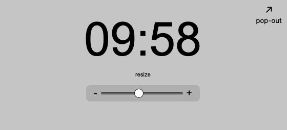

# FiftyFlow

Welcome to **FiftyFlow** — a simple Pomodoro-style break timer designed for **50-minute flow states** and **10-minute structured recovery**.

I made this because I found that traditional Pomodoro timers (25/5) didn’t match how my team or I naturally worked. We needed longer deep work periods, without losing the rhythm of the hour.

**FiftyFlow** syncs your work and break cycles to the real-world clock, chiming every time you hit a :00 or :50.  

No accounts, no ads, no distractions. Just a lightweight, flexible way to stay in sync with your best working pace.

[**See it Live Now →**](https://hellomynameisariel.github.io/fiftyflow/)

## Preview

---

## Features
- **50 minutes focus / 10 minutes break** built around the top of the hour.
- **Real-time sync** — always knows where you are in the hour.
- **Simple UI** — no clutter, no login, no learning curve.
- **Pop-out mode** to keep the timer in its own mini window.
- **Adjustable clock size** with a smooth slider.
- **Visual color cues** show time progression without chimes.

---

## Why I Built It
I'm not a professional coder. I just like making small tools that solve real-world workflow problems for myself and my team.  

FiftyFlow was created to help prevent burnout, encourage real recovery breaks, and build a natural cadence without micromanaging yourself.

---

## See More
You can find this and other lightweight tools on my Flow Tools page:  
[**See All Flow Tools by Ariel →**](https://hellomynameisariel.github.io/flowtools/)

---
